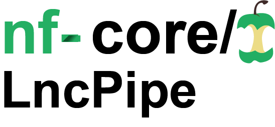
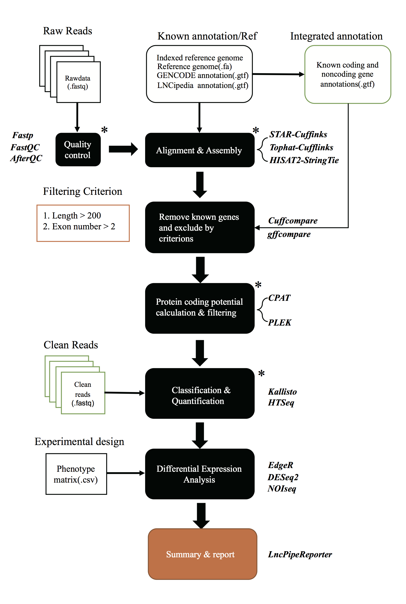

# 

**A Nextflow-based pipeline for comprehensive analyses of long non-coding RNAs from RNA-seq datasets**

### Introduction
Recently, long noncoding RNA molecules (lncRNA) captured widespread attentions for their critical roles in diverse biological process and important implications in variety of human diseases and cancers. Identification and profiling of lncRNAs is a fundamental step to advance our knowledge on their function and regulatory mechanisms. However, RNA sequencing based lncRNA discovery is currently limited due to complicated operations and implementation of the tools involved. Therefore, we present a one-stop multi-tool integrated pipeline called [LncPipe](https://github.com/likelet/LncPipe) focused on characterizing lncRNAs from raw transcriptome sequencing data. The pipeline was developed based on a popular workflow framework [Nextflow](https://github.com/nextflow-io/nextflow), composed of four core procedures including reads alignment, assembly, identification and quantification. It contains various unique features such as well-designed lncRNAs annotation strategy, optimized calculating efficiency, diversified classification and interactive analysis report. [LncPipe](https://github.com/likelet/LncPipe) allows users additional control in interuppting the pipeline, resetting parameters from command line, modifying main script directly and resume analysis from previous checkpoint.

### Documentation
The nf-core/lncpipe pipeline comes with documentation about the pipeline, found in the `docs/` directory:

1. [Installation](docs/installation.md)
2. Pipeline configuration
    * [Local installation](docs/configuration/local.md)
    * [Adding your own system](docs/configuration/adding_your_own.md)
3. [Running the pipeline](docs/usage.md)
4. [Output and how to interpret the results](docs/output.md)
5. [Run analysis for non-human species](docs/README_for_non_human_genome.md)
5. [Troubleshooting](docs/troubleshooting.md)

## Schematic diagram 

## Acknowledgment

Thanks to the author of [AfterQC](https://github.com/OpenGene/AfterQC)/fastp, Shifu Chen, for his help on providing a gzip output support to meet the require of LncPipe.  Thanks to the internal test by Hongwan Zhang and Yan Wang from SYSUCC Cancer bioinformatics platform.  

And also many thanks to the wonderful guys @apeltzer, @ewels and others from nf-core that help me to polish the code and structure of lncpipe.  

## Citation 

For details of LncPipe, plz read the article beblow :happy:  

> Qi Zhao, Yu Sun, Dawei Wang, Hongwan Zhang, Kai Yu, Jian Zheng, Zhixiang Zuo. LncPipe: A Nextflow-based pipeline for identification and analysis of long non-coding RNAs from RNA-Seq data. [J Genet Genomics. 2018 Jul 20;45(7):399-401](https://linkinghub.elsevier.com/retrieve/pii/S1673-8527(18)30117-6) 

