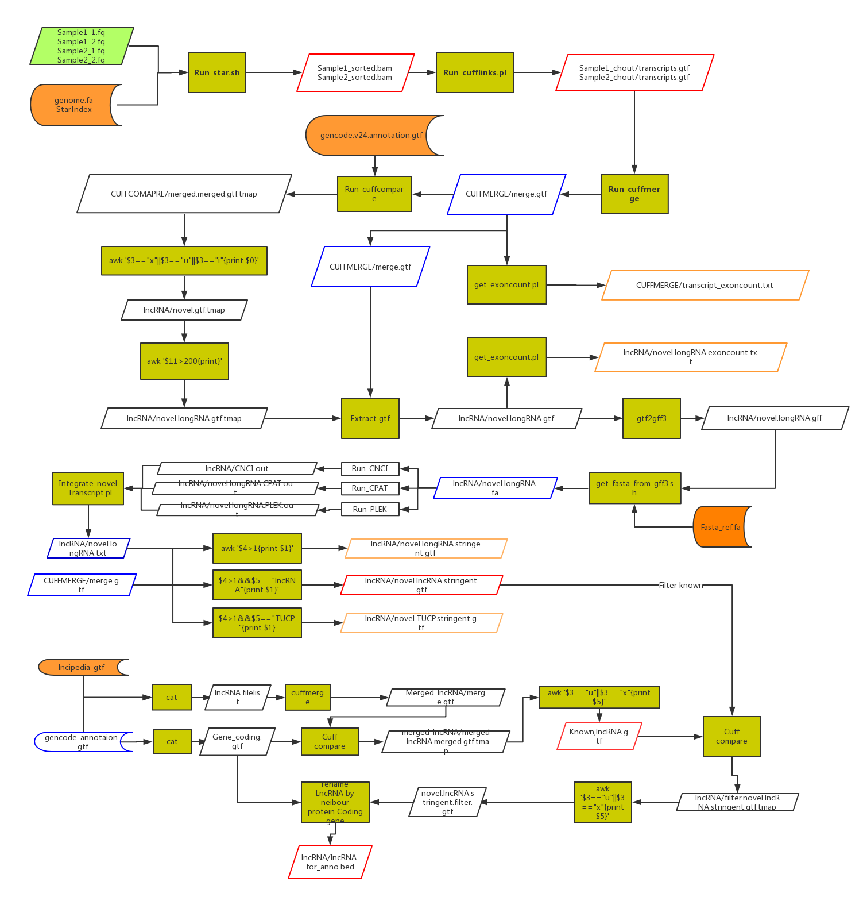

# [LncPipe](https://github.com/likelet/LncPipe) 
## Overall
Recently, long noncoding RNA molecules (lncRNA) captured widespread attentions for its critical 
roles in diverse biological process and important implications in variety of human diseases and 
cancers. Identification and profiling of lncRNAs is a fundamental step to advance our knowledge 
on their function and regulatory mechanisms. However, RNA sequencing based lncRNA discovery is 
limited due to complicated operations and implementation. Therefore, we presented a one-stop 
pipeline called [LncPipe](https://github.com/likelet/LncPipe) focused on characterizing lncRNAs from raw transcriptome sequencing 
data. The pipeline was developed based on a popular workflow framework [Nextflow](https://github.com/nextflow-io/nextflow), composed of 
four core procedures including reads alignment, assembly, identification and quantification. 
It contains various unique features such as well-designed lncRNAs annotation strategy, optimized 
calculating efficiency, diversified classification and interactive analysis report. Additionally, 
[LncPipe](https://github.com/likelet/LncPipe)  allows users cancel pipeline, reset parameters from command or modifying main script 
directly and resume analysis from continues checkpoint. 

## Schematic diagram
 

## Run LncPipe
Run the workflow
```shell
$ nextflow <your nf file> -c nextflow.config -with-trace
```

If the pipeline fails at any point and you fix the issue, you can revoke the processes with job avoidance using this command:
```shell
$ nextflow <your nf file> -c nextflow.config -with-trace -resume
```

All those pipelines were written in [Nextflow](https://github.com/nextflow-io/nextflow) commands. For more details, please see [here](https://www.nextflow.io).


## Run [LncPipe](https://github.com/likelet/LncPipe) from Docker image

## Installation of dependencies (Run [LncPipe](https://github.com/likelet/LncPipe)  at host environment ).
### Install [Nextflow](https://github.com/nextflow-io/nextflow)
LncPipe is implemented with Nextflow pipeline manage system. To run our pipelines. [Nextflow](https://github.com/nextflow-io/nextflow) should be preinstalled at  POSIX compatible system (Linux, Solaris, OS X, etc), It requires BASH and Java 7 or higher to be installed. We do not recommend running the pipes in the Windows since most of bioinformatic tools do not supported.
Here, we show the step by step installation of [Nextflow](https://github.com/nextflow-io/nextflow) in linux system as an example, which adapted from [NextFlow](https://www.nextflow.io/docs/latest/getstarted.html).

1. Download the executable package by copying and pasting the following command in your terminal window:
```shell
$ wget -qO- get.nextflow.io | bash
```
      It will create the [Nextflow](https://github.com/nextflow-io/nextflow) main executable file in the current directory.

2. Optionally, move the ```nextflow``` file in a directory accessible by your `$PATH` variable (this is only required to avoid to remember and type the Nextflow full path each time you need to run it).

Of course you can download the lastest binary version of NextFlow by yourself from the https://github.com/nextflow-io/nextflow/releases and add the path into your system environment.

### Install third-party software and databases required by each pipe
#### References, index and annotation files（required）

1. [STAR](https://github.com/alexdobin/STAR) index (hg38 genome index etc.)

2. Genome reference (genome fasta file with suffix `.fa` , `UCSC` etc.). If index not provided.

3. GENCODE gene annotation file in GTF format:[gencode.v26.annotation.gtf](ftp://ftp.sanger.ac.uk/pub/gencode/Gencode_human/release_26/gencode.v26.annotation.gtf.gz)

4. LNCipedia gene annotation file in GTF format:[lncipedia_4_0_hc_hg38.gtf](http://www.lncipedia.org/downloads/lncipedia_4_0_hc_hg38.gtf)

5. rRNA feature files from UCSC in GTF format.

#### Software and tools (required when docker image is not favored)
* 1. [STAR](https://github.com/alexdobin/STAR): [Citation](https://www.ncbi.nlm.nih.gov/pubmed/23104886)
      ```shell
      $ sudo aria2c https://raw.githubusercontent.com/alexdobin/STAR/master/bin/Linux_x86_64/STAR -q -o /opt/STAR && \
      chmod 755 /opt/STAR && \
      sudo ln -s /opt/STAR /usr/local/bin
      ```
* 2. [Cufflinks](https://github.com/cole-trapnell-lab/cufflinks): [Citation](https://www.ncbi.nlm.nih.gov/pmc/articles/PMC3146043/)
      ```shell
      $ sudo aria2c https://github.com/bioinformatist/cufflinks/releases/download/v2.2.1/cufflinks-2.2.1.Linux_x86_64.tar.gz -q -o /opt/cufflinks-2.2.1.Linux_x86_64.tar.gz && \
      tar xf /opt/cufflinks-2.2.1.Linux_x86_64.tar.gz --use-compress-prog=pigz -C /opt/ && \
      rm /opt/cufflinks-2.2.1.Linux_x86_64/README && \
      sudo ln -s /opt/cufflinks-2.2.1.Linux_x86_64/* /usr/local/bin/ && \
      rm /opt/cufflinks-2.2.1.Linux_x86_64.tar.gz
      ```
* 3. [Bedops](http://bedops.readthedocs.io/en/latest/):[Citation](https://www.ncbi.nlm.nih.gov/pubmed/22576172/)
      ```shell
      Coming: Waiting ysun's lastest docker file
      ```
* 4. [PLEK](www.ibiomedical.net): [Citation](https://bmcbioinformatics.biomedcentral.com/articles/10.1186/1471-2105-15-311)
      ```shell
      sudo aria2c https://nchc.dl.sourceforge.net/project/plek/PLEK.1.2.tar.gz -q -o /opt/PLEK.1.2.tar.gz && \
      tar xf /opt/PLEK.1.2.tar.gz --use-compress-prog=pigz -C /opt/ && \
      cd /opt/PLEK.1.2/ && \
      python PLEK_setup.py || : && \
      # Remove documents, demo files, source files, object files and R scripts
      rm *.pdf *.txt *.h *.c *.model *.range *.fa *.cpp *.o *.R *.doc PLEK_setup.py && \
      chmod 755 * && \
      # dos2unix in perl one-liner: remove BOM head and deal with \r problem
      perl -CD -pi -e'tr/\x{feff}//d && s/[\r\n]+/\n/' *.py && \
      sudo ln -s /opt/PLEK.1.2/* /usr/local/bin/ && \
      rm /opt/PLEK.1.2.tar.gz
      ```
* 5. [CNCI](https://github.com/www-bioinfo-org/CNCI): [Citation](https://www.ncbi.nlm.nih.gov/pmc/articles/PMC3783192/)
      ```shell
      sudo aria2c https://codeload.github.com/www-bioinfo-org/CNCI/zip/master -q -o /opt/CNCI-master.zip && \
      unzip -qq /opt/CNCI-master.zip -d /opt/ && \
      rm /opt/CNCI-master.zip && \
      unzip -qq /opt/CNCI-master/libsvm-3.0.zip -d /opt/CNCI-master/ && \
      rm /opt/CNCI-master/libsvm-3.0.zip && \
      cd /opt/CNCI-master/libsvm-3.0 && \
      make > /dev/null 2>&1 && \
      # enable the extglob shell option
      shopt -s extglob && \
      # Parentheses and the pipe symbol should be escaped
      rm -rfv !\("svm-predict"\|"svm-scale"\) && \
      cd .. && \
      rm draw_class_pie.R LICENSE README.md && \
      chmod -R 755 * && \
      sudo ln -s /opt/CNCI-master/*.py /usr/local/bin/
      ```
* 6. [CPAT](http://rna-cpat.sourceforge.net):[Citation](https://academic.oup.com/nar/article/41/6/e74/2902455/CPAT-Coding-Potential-Assessment-Tool-using-an)
      ```shell
      sudo aria2c https://jaist.dl.sourceforge.net/project/rna-cpat/v1.2.3/CPAT-1.2.3.tar.gz -q -o /opt/CPAT-1.2.3.tar.gz && \
      tar xf /opt/CPAT-1.2.3.tar.gz --use-compress-prog=pigz -C /opt/ && \
      # DO NOT use absolute path here, changing directory is necessary, python interpreter will check current directory for dependencies
      cd /opt/CPAT-1.2.3/ && \
      mv dat/* /LncPipeDB/ && \
      python setup.py install > /dev/null 2>&1 && \
      rm -rf /opt/CPAT*
      ```
* 7. [FastQC](https://www.bioinformatics.babraham.ac.uk/projects/fastqc) or [AfterQC](https://github.com/OpenGene/AfterQC).
      ```shell
      To be finish later.
      ```
When using afterQC, we recommended that users install `pypy` in your operation system, which can accelerated about 3X speed for raw reads processing, as [suggested]((https://github.com/OpenGene/AfterQC#pypy-suggestion)) by author of AfterQC.

* 8. Install [LncPipeReporter](https://github.com/bioinformatist/LncPipe-Reporter)

      Install [pandoc](https://pandoc.org/installing.html) first. Then run commands:
      ```shell
      Rscript -e "install.packages('devtools'); devtools::install_github('bioinformatist/LncPipeReporter')"
      ```
For detailed usage of LncPipeReporter in case you are going to run it separately, plz refers to [README](https://github.com/bioinformatist/LncPipeReporter#lncpipereporter) of LncPipeReporter.
## Interactive reports
LncPipe output was well-summarized in an interactive manner, which was carried out by a novel-developing R package
[LncPipeReporter](https://github.com/bioinformatist/LncPipeReporter).

## Configuration for use at the first time
As a nextflow-based analysis pipeline, LncPipe allow users edit configure file `nextflow.config` to set the index files and default file path parameters instead of typing in command.
We strongly recommended that users using config file rather than command input to adjust their parameters.
For example, plz go to `params` line, and set the following information of your operation system and environment
```groovy
params {
////////////////////////////////////
//USER MODIFICATIONS //
   fasta_ref = 'your/genome/reference/path/genome.fa'
   //star index
   star_idex = 'your/STAR/reference/index/path'
   //bowtie index
      //bowtie2_index=''

   gencode_annotation_gtf = "Path/to/gencode/annotation/gencode.v24.annotation.gtf"
   lncipedia_gtf = "Path/to/lncipedia/annotation/lncipedia_4_0_hg38.gtf"
   rRNAmask = "Path/to/rRNA/annotation/hg38_rRNA.gtf";

// software path
   plekpath = 'Path/to/PLEK/PLEK.1.2/'
   cncipath = 'Path/to/CNCI-master'
   cpatpath = 'Path/to/CPAT-1.2.2/'
// set aligner
    aligner = "star"
           sam_processor="sambamba" // If aligner is hisat, we need process sam file for downstream analysis
    qctools = "afterqc"
           afterqc_path="/data/software/afterQC/AfterQC-master/"
//other options
  //sequencing strategy
   singleEnd = false
  //skip options
   skip_combine = false

  //resource information
   mem=50
   cpu=40
////////////////////////////////

}

```

## Parameters
> Those parameters would cover the setting from `nextflow.config` file
* #### Mandatory
| Name | Example/Default value | Description |
|-----------|--------------:|-------------|
|--input_folder | `.` | input folder |
|--fastq_ext | `*_{1,2}.fastq.gz` | input raw paired reads |
|--out_folder |  `.` | output folder |
|--aligner |  `star` | Aligner for reads mapping (optional), STAR is default and supported only at present,*star*/*tophat*/*hisat2*|
|--qctools |  `afterqc` | Tools for assess raw reads quality or filtered by AfterQC, *fastqc* or *afterqc*|
* #### References(can be configured in *nextflow.config* file)

| Name | Required | Description |
|-----------|--------------|-------------|
|--star_index/--bowtie2_index/--hisat2_index  | -| Path to STAR／bowtie2/hisat2(mutually exclusive) index(required if not set in config file)  |
|--fasta  | `-` | Path to Fasta reference(required if not set in config file)|
|--gencode_annotation_gtf  | `-` | An annotation file from GENCODE database for annotating lncRNAs(required if not set in config file). e.g. [gencode.v26.annotation.gtf](ftp://ftp.sanger.ac.uk/pub/gencode/Gencode_human/release_26/gencode.v26.annotation.gtf.gz) |
|--lncipedia_gtf  | `-` | An annotation file from LNCipedia database for annotating lncRNAs(required if not set in config file) e.g. [lncipedia_4_0_hc_hg38.gtf](http://www.lncipedia.org/downloads/lncipedia_4_0_hc_hg38.gtf) |
|--rRNAmask  | `-` |rRNA GTF for filtering rRNA transcript from gtf files(required if not set in config file) e.g. |

* #### Optional

| Name | Default value | Description |
|-----------|--------------|-------------|
|--singleEnd  | `FALSE` | specify that the reads are single ended  |
|--merged_gtf | `FALSE` | Skip mapping and assembly step by directly providing assembled merged gtf files|
|--design     | `FALSE` | a txt file that stored experimental design information, plz see details from `--design` section below |

* #### LncPipeReporter options

| Name | Default value | Description |
|-----------|--------------|-------------|
|--lncRep_Output  | `reporter.html` | Specify report file name. |
|--lncRep_theme  | `npg` | Plot theme setting in interactive plot. Values from [ggsci](https://github.com/road2stat/ggsci) |
|--lncRep_min_expressed_sample  | `50` |Minimum expressed gene allowed in each sample, 50 default. Samples not passed were filtered from analysis|

### --fastq_ext
> Raw fastq files were required for denovo analysis.This parameters should be set according to your paired or singled reads file names.
Suppose your paired end sequence files are compressed with `.gz` suffixed.
For example:
```
Sample1_1.fq.gz
Sample1_2.fq.gz
Sample2_1.fq.gz
Sample2_2.fq.gz
```
Then you can input pattern `*_{1,2}.fq.gz` to make the all paired end file recognized by [LncPipe](https://github.com/likelet/LncPipe) .

For singled reads file, file pattern should be feed with `--singleEnd` specified.


### --star_idex／--bowtie2_index/--hisat2_index

> This parameter is *required* when not configured in nextflow.config file. It specify the star/tophat/hisat2(mutually exclusive) index folder built before running [LncPipe](https://github.com/likelet/LncPipe) .
If you don't know what it is，You can use `--fasta` to specify the reference sequence data. The index file would be built by [LncPipe](https://github.com/likelet/LncPipe)  automatically.


### --design
> Experimental design file matrix for differential expression analysis. Default: `null`
Format:
```
WT:Sample1,Sample2,Sample3
KO:Sample1,Sample2,Sample3
```
While `KO/WT` represents the two experimental condition, and sample1, sample2, sample3 are replicates which should be comma-delimited in the same line .

For sample names, it should be the sample as the prefix of fastq files which was trimmed by `--fastq_ext`.

For example:

 if fastq file names are `Sample1_1.fq.gz, Sample1_2.fq.gz` that comes from one sample and your `--fastq_ext` is set as `*_{1,2}.fq.gz`, the sample name
should be Sample1.

## Output folder structure
While the whole pipeline is finished properly, there is `Result` folder under current path(default) or output_folder set by user. The basic structure of Result is follows:
```
Result/
├── QC
│   ├── N1141_1.clean_fastqc.html
│   ├── N1141_2.clean_fastqc.html
│   ├── N1177_1.clean_fastqc.html
│   └── N1177_2.clean_fastqc.html
├── Identified_lncRNA
│   ├── all_lncRNA_for_classifier.gtf
│   ├── final_all.fa
│   ├── final_all.gtf
│   ├── lncRNA.fa
│   ├── protein_coding.fa
│   └── protein_coding.final.gtf
├── LncReporter
│   ├── Differential_Expression_analysis.csv
│   └── Report.html
├── Quantification
│   ├── kallisto.count.txt
│   └── kallisto.tpm.txt
└── Star_alignment
    ├── STAR_N1141
    │   ├── N1141Aligned.sortedByCoord.out.bam
    │   ├── N1141Log.final.out
    │   ├── N1141Log.out
    │   ├── N1141Log.progress.out
    │   └── N1141SJ.out.tab
    └── STAR_N1177
        ├── N1177Aligned.sortedByCoord.out.bam
        ├── N1177Log.final.out
        ├── N1177Log.out
        ├── N1177Log.progress.out
        └── N1177SJ.out.tab
```

* `QC` stored the Quality control output generated by FastQC or AfterQC software.<br>
* `Identified_lncRNA` contains all assembled lncRNA and their sequences. *all_lncRNA_for_classifier.gtf* includes both novel and known lncRNA features in [GTF format](http://www.ensembl.org/info/website/upload/gff.html);
*lncRNA.fa* is all lncRNA sequences in fasta format. *protein_coding.final.gtf* and *protein_coding.fa* are protein coding information extracted from gencode annotation. *final_all.gtf* and *final_all.fa* are combined files for further analysis.<br>
* `Star_alignment` are STAR aligner standard output<br>
* `Quantification` are estimated abundance using kallisto. *kallisto.count.txt* are reads count matrix and *kallisto.tpm.txt* are tpm(Transcripts Per Kilobase Million) matrix.
* `LncReporter` stored the interactive report file and differential expression matrix generated by EdgeR.

## About
This pipe were written by [Qi Zhao](https://github.com/likelet) and [Yu Sun](http://icannotendure.space) from Sun Yat-sen University and Nan kai University.
For details and help, plz contact any one of us by zhaoqi@sysucc.org.cn and sun_yu@mail.nankai.edu.cn.


## License
[GPL v3 license](LICENSE)
## Citation 

