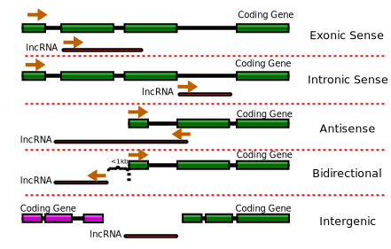

# nf-core/lncpipe: Output

This document describes the output produced by the pipeline. Most of the plots are taken from the MultiQC report and  LncpipeReporter, that summarizes the result at the end of the pipeline.


## Pipeline overview
The pipeline is built using [Nextflow](https://www.nextflow.io/)
Plz see a detailed illustration in our [literature](https://linkinghub.elsevier.com/retrieve/pii/S1673-8527(18)30117-6). 

## Result Folder structure

`Result` folder under current path(default) or output_folder set by user. A typical structure of `Result` is follows:

        Result/
            ├── QC
            │   ├── N1141_1.clean_fastqc.html
            │   ├── N1141_2.clean_fastqc.html
            │   ├── N1177_1.clean_fastqc.html
            │   └── N1177_2.clean_fastqc.html
            ├── Identified_lncRNA
            │   ├── all_lncRNA_for_classifier.gtf
            │   ├── final_all.fa
            │   ├── final_all.gtf
            │   ├── lncRNA.fa
            │   ├── protein_coding.fa
            │   └── protein_coding.final.gtf
            ├── LncReporter
            │   ├── Differential_Expression_analysis.csv
            │   └── Report.html
            ├── Quantification
            │   ├── kallisto.count.txt
            │   └── kallisto.tpm.txt
            └── Star_alignment
                ├── STAR_N1141
                │   ├── N1141Aligned.sortedByCoord.out.bam
                │   ├── N1141Log.final.out
                │   ├── N1141Log.out
                │   ├── N1141Log.progress.out
                │   └── N1141SJ.out.tab
                └── STAR_N1177
                    ├── N1177Aligned.sortedByCoord.out.bam
                    ├── N1177Log.final.out
                    ├── N1177Log.out
                    ├── N1177Log.progress.out
                    └── N1177SJ.out.tab

* `QC` stored the Quality control output generated by FastQC or AfterQC software.<br>
* `Identified_lncRNA` contains all assembled lncRNA and their sequences. *all_lncRNA_for_classifier.gtf* includes both novel and known lncRNA features in [GTF format](http://www.ensembl.org/info/website/upload/gff.html);
*lncRNA.fa* is all lncRNA sequences in fasta format. *protein_coding.final.gtf* and *protein_coding.fa* are protein coding information extracted from gencode annotation. *final_all.gtf* and *final_all.fa* are combined files for further analysis.<br>
* `Alignment` are hisat/tophat/STAR aligner standard output<br>
* `Quantification` are estimated abundance using kallisto. *kallisto.count.txt* stored reads count matrix and *kallisto.tpm.txt* are tpm(Transcripts Per Kilobase Million) matrix.
* `LncReporter` stored the interactive report file and differential expression matrix generated by LncPipeReporter which wrapped EdgeR.


**Output directory: `results/QC`**

* `sample_fastqc.html`
  * FastQC report, containing quality metrics for your untrimmed raw fastq files
* `zips/sample_fastqc.zip`
  * zip file containing the FastQC report, tab-delimited data file and plot images


**Output directory: `results/Combined_annotations`**  

* `known.lncRNA.gtf`
  * known lncRNA gene annotation file from provided `GTF` files, can be stored for further comparison 
* `gencode_protein_coding.gtf`
  * known protein coding gene annotation file from provided `GTF` files
* `*_mod.gtf` (less information )
  * formatted GTF from the provided `GTF` files by users 

**Output directory: `results/*_alignment`**  

* `*_summary.txt`
  * alignment summary files generated by aligner such as tophat, hisat2 and STAR. A typical content are as follow:  
    ```
    453727 reads; of these:
      453727 (100.00%) were paired; of these:
        434333 (95.73%) aligned concordantly 0 times
        19339 (4.26%) aligned concordantly exactly 1 time
        55 (0.01%) aligned concordantly >1 times
        ----
        434333 pairs aligned concordantly 0 times; of these:
          279639 (64.38%) aligned discordantly 1 time
        ----
        154694 pairs aligned 0 times concordantly or discordantly; of these:
          309388 mates make up the pairs; of these:
            4095 (1.32%) aligned 0 times
            303301 (98.03%) aligned exactly 1 time
            1992 (0.64%) aligned >1 times
    99.55% overall alignment rate 
    ```  
* `*sort.bam`
  * alignment result in bam format.    
      
**Output directory: `results/Identified_lncRNA`**  

* `*all_lncRNA_for_classifier.gtf `
  * A final identified lncRNA `GTF` that contains both known lncRNA and novel lncRNAs. It also includes the lncRNA relative position to the nearest genes.   
  
* `final_all.gtf `
  * A `GTF` that contains both  lncRNA and protein coding RNA. It includes the lncRNA relative position to the nearest genes. 
       
* `lncRNA.fa `
  * All lncRNA sequences in `fasta` format   
  
* `protein_coding.fa`
  * All protein sequences in `fasta` format     
  
* `final_all.fa`
  * All protein + lncRNA sequences in `fasta` format     
   
* `lncRNA_classification.txt`
  * A detailed classification of all lncRNAs according to their coordinate in the chromosome. A detailed illustration of the lncRNA class  are shown below  
     
   
* `lncRNA.mapping.file`
  * In the output file, we renamed all lncRNA according their nearest gene for both known and new identified genes. This file contains the name map information between changed name and origin name of the known lncRNAs.
     

   
**Output directory: `results/LncPipeReports`**  

  * LncPipeReporter generated report, plz open the reporter.html directly.   
  
**Output directory: `results/Merged_assemblies`** 
 
 * `merged.gtf `
   * Initial merged GTF by merge assemblies from individual sample. Can be used as input of `--merged_gtf` parameter 
      
**Output directory: `results/Quantification`**  

* `kallisto.count.txt `
   * reads count matrix at gene level with each line represent a gene and each column represent a sample. NOTE: The second column recorded the gene type, e.g. `proten_coding` or `known` lncRNA or `novel` lncRNA that were not included in the provided gtf 
      
* `kallisto.tpm.txt`
   * expression matrix at gene level in `TPM` format. A detailed explanation of TPM can be found in [here](https://haroldpimentel.wordpress.com/2014/05/08/what-the-fpkm-a-review-rna-seq-expression-units/)
 


